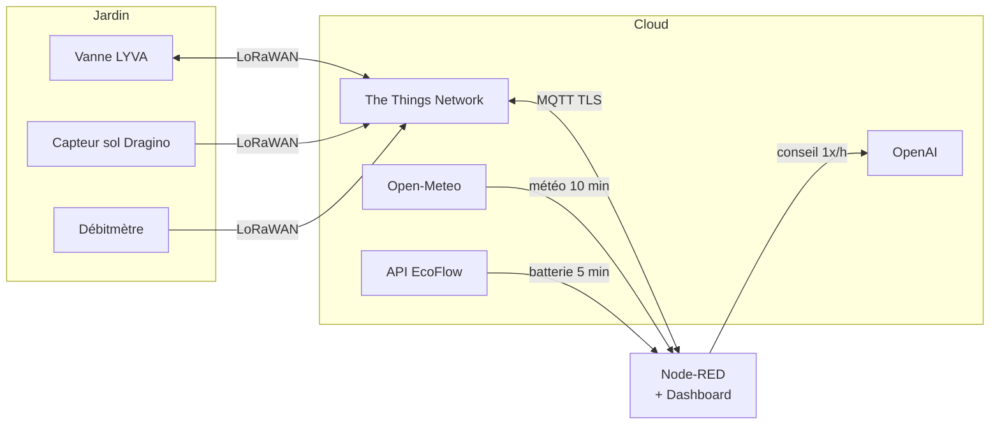
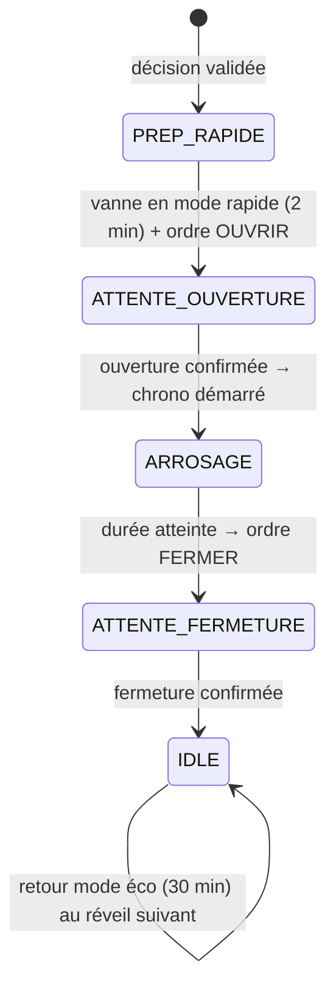

# 🌱 Notice du jardin automatisé — comment tout fonctionne

*Notice utilisateur du système d'arrosage automatique en permaculture — Saint-Quentin-Fallavier.*
*Correspond au fichier `flows_82_corrige.json` (juillet 2026).*

---

## 1. Vue d'ensemble

Le système arrose automatiquement un jardin en permaculture (~24 m², arrosage
**souterrain**) en croisant quatre sources d'information :

- **le sol** (capteur d'humidité enterré),
- **la météo** (prévisions locales),
- **l'énergie** (batterie EcoFlow qui alimente l'installation),
- **une IA** (OpenAI) qui joue le rôle de conseiller-jardinier.

Le cerveau est un serveur **Node-RED** (sous Windows). Les équipements du jardin
communiquent en **LoRaWAN** via The Things Network (TTN) : très basse
consommation, longue portée, mais des échanges lents et espacés — toute la
logique du système est construite autour de cette contrainte.

**Principe fondamental : l'IA ne commande jamais la vanne directement.** Elle
donne un avis (« arroser 4 minutes », « rester en veille ») et Node-RED revérifie
*toutes* les sécurités avant d'agir. En cas de doute, le système choisit
toujours de ne pas arroser.

---

## 2. Le matériel

| Équipement | Identifiant TTN | Rôle | Remontées |
|---|---|---|---|
| **Vanne LYVA** | `lyva-tre` | Ouvre/ferme l'eau | État confirmé (Ouvert/Fermé) + batterie, à chaque réveil |
| **Capteur sol Dragino** | `dragino-moisture` | Mesure le sol | Humidité %, température, conductivité, batterie (volts) |
| **Débitmètre** | `debitmetre` | Compte l'eau | Index total en litres + batterie |
| **Batterie EcoFlow** | (API cloud, série R351…) | Alimente l'installation | Charge %, puissance entrée/sortie, toutes les 5 min |

### La vanne et ses « réveils »

La vanne LoRaWAN **dort** presque tout le temps pour économiser sa batterie.
Elle ne se réveille que périodiquement pour écouter les ordres :

- **Mode ÉCO** : réveil toutes les **30 minutes** (fonctionnement normal),
- **Mode RAPIDE** : réveil toutes les **2 minutes** (pendant un arrosage).

Conséquence importante : **un ordre envoyé n'est pas exécuté immédiatement** —
il attend le prochain réveil de la vanne. Et l'envoi ne vaut pas confirmation :
le système ne considère la vanne « ouverte » ou « fermée » que lorsqu'elle l'a
elle-même confirmé à son réveil suivant.

### Les commandes (downlinks)

| Port | Code | Effet |
|---|---|---|
| 10 | `01` | OUVRIR la vanne |
| 10 | `02` | FERMER la vanne |
| 11 | `02` | Passer en mode RAPIDE (réveil 2 min) |
| 11 | `1E` | Passer en mode ÉCO (réveil 30 min) |

Les envois vers TTN passent par une **file d'attente (1 message / 4 s)** pour
respecter les limites du réseau, et par une connexion **MQTT chiffrée (TLS)**.

---

## 3. Le cycle d'arrosage automatique

C'est le cœur du système. Toutes les **heures**, quand le mode **AUTO** est
activé :

### Étape 1 — Le Pré-check (le videur à l'entrée)

Node-RED vérifie une quinzaine de conditions **avant même de consulter l'IA**.
Si une seule échoue → **VEILLE**, motif consigné dans l'historique, et
l'appel OpenAI n'a même pas lieu (aucun coût). Les règles :

| Règle | Valeur par défaut |
|---|---|
| Pas de mode maintenance | — |
| Énergie EcoFlow OK et données récentes | coupure ≤ 10 %, données < 15 min |
| Mode AUTO activé | — |
| Automatisme au repos (pas d'arrosage en cours) | — |
| Capteur sol valide et récent | < 3 h |
| Météo récente | < 2 h |
| Vanne fermée, état confirmé récent | < 4 h |
| Humidité sous le seuil du profil plante | ex. < 17 % |
| Plage horaire | 7 h – 20 h (heure de Paris) |
| Pas de pluie significative aujourd'hui | ≤ 3 mm |
| Pas de pluie probable dans 3 h | ≤ 60 % |
| Écart minimum depuis le dernier arrosage | ≥ 6 h (selon profil) |
| Limite d'arrosages automatiques du jour | ≤ 2 |
| Quota d'eau journalier non atteint | ≤ 200 L |

### Étape 2 — Le conseil de l'IA

Si tout passe, Node-RED envoie à OpenAI (`gpt-4o-mini`) un dossier complet :
humidité, profil de plante, météo, saison, historique des arrosages,
calibration (combien de % d'humidité gagnés par minute d'eau), quota restant…
L'IA répond en JSON : `ARROSER` ou `VEILLE`, une durée, une confiance (0 à 1)
et une explication.

### Étape 3 — La revalidation (l'IA ne décide pas seule)

Node-RED **revérifie toutes les règles** de l'étape 1 sur la réponse de l'IA,
borne la durée entre 1 et **5 minutes max**, et rejette tout conseil avec une
confiance < 0,55. Si le moindre blocage apparaît → VEILLE.

### Étape 4 — La séquence d'arrosage

Un arrosage validé déroule cette machine à états, pilotée à chaque réveil de
la vanne par le « Chef d'Orchestre » :

Puis, **3 heures après la fermeture** (le temps que l'eau atteigne la zone du
capteur en arrosage souterrain), le système note l'humidité « après » et
enregistre l'arrosage dans l'historique de calibration : c'est ainsi qu'il
apprend combien chaque minute d'eau fait monter l'humidité.

---

## 4. Les sécurités

| Sécurité | Comportement |
|---|---|
| **Coupure énergie** | Batterie EcoFlow ≤ **10 %** → arrêt : AUTO coupé, vanne fermée, arrosage interdit. Reprise seulement à **25 %** (l'écart évite les oscillations). L'état AUTO est réactivé automatiquement à la reprise s'il était actif |
| **⚠️ Interrupteur de la sécurité EcoFlow** | Les deux sécurités énergie ci-dessus (coupure et absence de données) sont **désactivées par défaut** et réactivables via **Réglages → 🛡 Sécurité énergie EcoFlow**. Désactivées, l'arrosage continue même batterie vide ou hors ligne — un bandeau d'avertissement s'affiche sur la page Jardin |
| **EcoFlow silencieuse** | Aucune donnée depuis > 15 min → toute *ouverture* de vanne est bloquée (les fermetures restent permises). Un watchdog (2 min) détecte la déconnexion complète et les erreurs d'API |
| **Timeout de commande** | Ordre non confirmé par la vanne après **10 min** → erreur consignée, automatisme remis au repos (les commandes manuelles restent possibles) |
| **Anti-blocage** | Un état d'automatisme figé > 2 h est remis au repos d'office |
| **Quota d'eau** | **200 L/jour** mesurés par le débitmètre → au-delà, l'AUTO est bloqué jusqu'au lendemain (le manuel reste possible) |
| **Anti-rafale** | 10 s minimum entre deux ordres ; file d'attente TTN 1 msg/4 s |
| **Mode maintenance** | Bloque l'IA et l'automatisme, conserve les commandes manuelles |
| **Reset d'urgence** | Bouton dans l'éditeur Node-RED (onglet Arrosage, inject « 🔴 Reset d'urgence ») : remet tout au repos et libère le quota d'eau |

En résumé : **pour qu'une goutte d'eau coule automatiquement, il faut que tout
aille bien partout.** N'importe quelle anomalie fige le système en position sûre
(vanne fermée).

---

## 5. Les profils de plantes

Le capteur, enterré, lit une plage basse : sur cette installation,
**20-25 % = sol humide** (ne pas comparer aux 40-60 % des capteurs de surface).
Les profils règlent les seuils en conséquence :

| Profil | Déclenche sous | Objectif | Écart min | Max/jour |
|---|---|---|---|---|
| Permaculture mixte *(défaut)* | 17 % | 22 % | 6 h | 2 |
| Tomates / poivrons / aubergines | 17 % | 22 % | 8 h | 2 |
| Salades / feuilles / basilic | 18 % | 23 % | 6 h | 2 |
| Courgettes / concombres | 18 % | 24 % | 6 h | 2 |
| Aromatiques méditerranéennes | 14 % | 18 % | 12 h | 1 |
| Semis / jeunes plants | 19 % | 24 % | 6 h | 2 |

Les seuils s'ajustent automatiquement de ±1 % selon la saison (été/hiver). Le
profil actif se change sur la **page IA** du dashboard.

---

## 6. Le dashboard (5 pages)

Le dashboard suit le design « Dashboard Ocean » : fond bleu-vert profond,
cartes arrondies, accent **sauge** pour les capteurs et états normaux, accent
**terracotta** pour les actionneurs et l'arrosage. La barre de navigation en
« pilule » en haut de chaque page permet de circuler ; l'onglet actif est
rempli en sauge.

### 🌱 Jardin (page principale)
- **État système** (en haut) : vanne, mode, batterie EcoFlow, eau restante,
  dernière décision IA — et un **bandeau d'alerte persistant** (rouge = coupure
  énergie, orange = maintenance ou EcoFlow muette).
- **Capteur & Débit** : humidité, température, litres du jour, réservoir/quota.
- **État Vanne** : visuel de la vanne, boutons **OUVRIR / FERMER**,
  interrupteur **AUTO**, réglage de la fréquence de réveil.
- **Journal** : les 50 derniers événements (ordres, confirmations, mesures,
  erreurs).

### 🌤 Météo
Prévisions complètes à Saint-Quentin-Fallavier (Open-Meteo, rafraîchies toutes
les 10 min) : conditions actuelles, 24 h heure par heure, 8 jours, qualité de
l'air, UV, vent, lever/coucher du soleil.

### 🤖 IA
- **Conseil IA** : dernière analyse détaillée (raison, confiance, âges des
  données, quota).
- **Historique des décisions** : les 200 dernières décisions avec motifs.

### ⚡ EcoFlow
État détaillé de la batterie : charge, puissances, temps restant, connexion.
Alertes (déconnexion, coupure, reprise) affichées en notification sur toutes
les pages.

### ⚙️ Réglages
- **Profil de culture** : choix de la culture, seuils appliqués par l'IA.
- **Mode maintenance** : interrupteur ON/OFF (suspend les décisions
  automatiques, la vanne reste pilotable à la main).

---

## 7. Utilisation au quotidien

| Je veux… | Comment |
|---|---|
| **Arroser tout de suite** | Page Jardin → bouton **OUVRIR**. La vanne s'ouvrira à son prochain réveil (jusqu'à 30 min en mode éco — le système passe automatiquement en mode rapide ensuite). Ne pas oublier **FERMER** ! |
| **Activer l'arrosage automatique** | Page Jardin → interrupteur **AUTO**. L'IA analysera toutes les heures |
| **Changer de culture** | Page Réglages → Profil de culture |
| **Bricoler sans que l'IA s'en mêle** | Page Réglages → **Maintenance ON** (les boutons manuels restent actifs) |
| **Comprendre pourquoi ça n'arrose pas** | Page IA → Historique : chaque veille indique son motif exact (« pluie probable 70 % », « quota atteint », etc.) |
| **Vérifier la consommation d'eau** | Page Jardin → carte État système ou Réservoir |
| **Débloquer un état bizarre** | Éditeur Node-RED → onglet Arrosage → bouton de l'inject « 🔴 Reset d'urgence » |

⚠️ **Patience LoRaWAN** : entre un clic sur OUVRIR et l'eau qui coule, il peut
s'écouler jusqu'à 30 minutes (réveil de la vanne) + la confirmation. C'est
normal. Le statut « en attente » sur la carte État système suit la commande.

---

## 8. Que faire si… (dépannage)

| Symptôme | Cause probable | Solution |
|---|---|---|
| Bandeau rouge « Coupure énergie » | Batterie EcoFlow ≤ 10 % ou hors ligne | Recharger / rallumer l'EcoFlow ; tout se réarme seul à 25 % |
| Bandeau orange « EcoFlow sans données » | EcoFlow éteinte, Wi-Fi coupé, ou API en panne | Vérifier l'appareil et sa connexion ; les ouvertures sont bloquées par sécurité en attendant |
| « Timeout LoRaWAN : commande non confirmée » | Vanne hors de portée, batterie vide, ou réseau TTN | Vérifier la batterie de la vanne et la couverture ; renvoyer l'ordre manuellement |
| L'IA ne fait jamais rien | Mode MANUEL, maintenance active, hors plage 7 h-20 h, ou un blocage récurrent | Lire le motif exact dans l'historique IA |
| « ❌ OPENAI_API_KEY manquante » dans les logs | Variable d'environnement absente | Définir `OPENAI_API_KEY` sur le serveur et redémarrer Node-RED |
| Historique/quota remis à zéro après un redémarrage | Persistance non activée | Activer `contextStorage: localfilesystem` dans `settings.js` (voir CORRECTIONS.md) |
| Humidité qui semble fausse | Capteur en limite de zone racinaire | Rappel : 20-25 % = humide sur ce montage ; ajuster le profil si besoin |

---

## 9. Régler les paramètres

Tous les réglages (quota, plages horaires, seuils, durées, fuseau horaire,
profils) sont centralisés dans **une seule fonction** de l'éditeur Node-RED :
onglet **Arrosage jardin** → nœud **« ⚙️ Init Config Jardin v7 »**. Modifier la
valeur voulue dans `DEFAULT_CONFIG`, puis **Deploy** — la nouvelle config
s'applique au démarrage suivant du flow (l'inject « Init » la recharge
aussi immédiatement).

Principaux réglages : `dailyWaterQuotaL` (200 L), `minHour`/`maxHour`
(7-20 h), `maxIrrigationMin` (5 min), `maxAutoWateringsPerDay` (2),
`minHoursBetweenWatering` (6 h), `rainDailyBlockMm` (3 mm),
`timezone` (Europe/Paris).

---

## 10. Sous le capot (pour mémoire)

- **3 onglets Node-RED** : *Arrosage jardin* (logique principale), *Météo*
  (collecte Open-Meteo), *EcoFlow* (surveillance énergie).
- **Cadences** : météo 10 min · EcoFlow 5 min · watchdog EcoFlow 2 min ·
  watchdog vanne 1 min · analyse IA 1 h · carte État système 30 s.
- **Mémoire du système** (contexte Node-RED) : état vanne, historique
  d'arrosages (30 entrées), journal IA (200), journal d'événements (50),
  quota d'eau du jour, calibration. Persistant sur disque si
  `contextStorage` est activé.
- **Sécurité des secrets** : la clé OpenAI vit en variable d'environnement
  (jamais dans les exports), les identifiants TTN dans le fichier credentials
  chiffré de Node-RED, le MQTT est en TLS vérifié.

*Document généré à partir de l'analyse complète du flow — voir CORRECTIONS.md
pour l'historique des correctifs et optimisations.*

---

## 11. Synchronisation GitHub → Node-RED

Le fichier `sync_dashboard.ps1` (à la racine du dépôt cloné sur le serveur
Windows) tire la branche GitHub et déploie automatiquement les flows dans
Node-RED via son API d'administration — sans passer par Import/Export :

1. Cloner le dépôt sur le serveur : `git clone https://github.com/Moha-667/Claude-code-Jardin.git`
2. Lancer la surveillance : `powershell -ExecutionPolicy Bypass -File sync_dashboard.ps1 -Watch`
   (ou en tâche planifiée au démarrage). Toute modification poussée sur la
   branche est déployée dans la minute.
3. Si l'éditeur est protégé par mot de passe : ajouter `-User … -Password …`.

Les identifiants (TTN, OpenAI, EcoFlow) ne transitent jamais par GitHub :
ils restent dans le fichier credentials chiffré local, préservé par le
déploiement API. Alternative intégrée : la fonctionnalité **Projects** de
Node-RED (`editorTheme.projects.enabled = true` dans `settings.js`) relie
l'éditeur au dépôt git, avec un bouton *pull* manuel dans le menu.
